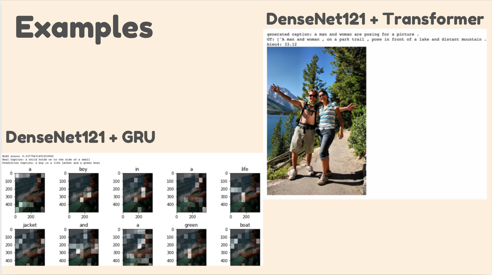
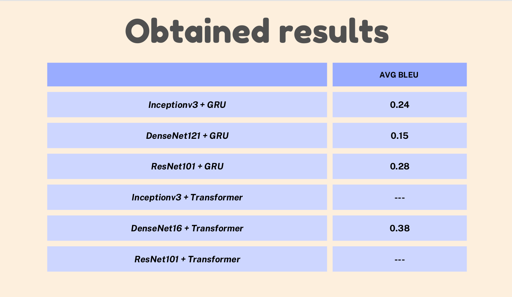

# image-captioning
This repository attepts to compare architectures for the task of image captioning \
Dataset: Flickr8k link: https://www.kaggle.com/datasets/adityajn105/flickr8k

Architectures compared: 
1) InceptionV3 + GRU/Transformer
2) Densenet121 + GRU/transformer
3) Resnet101 + GRU/transformer

